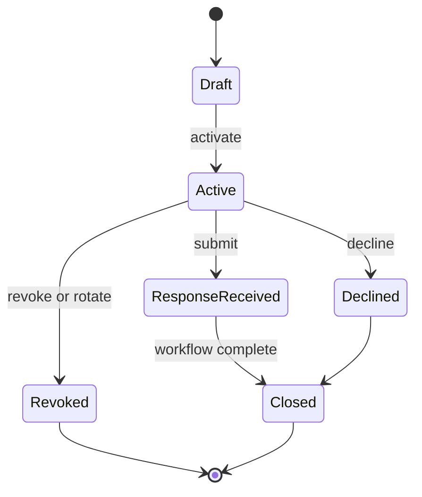
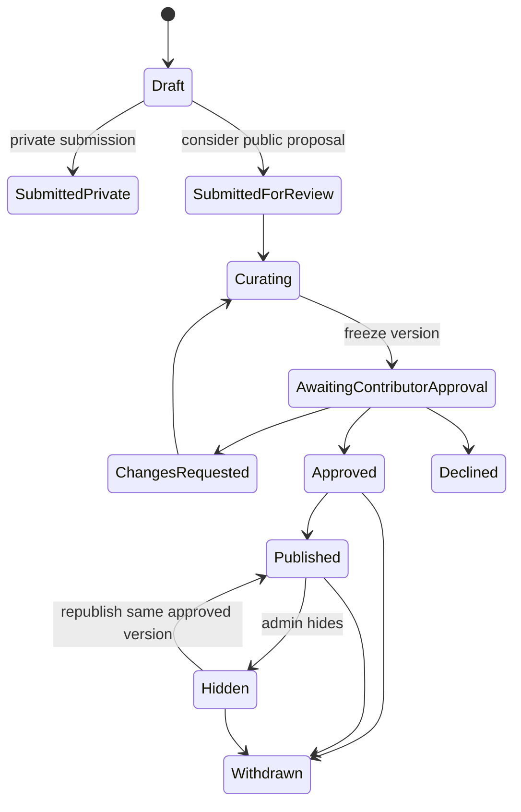

# Athar / أثر — Endorsement System Implementation Plan

> Status: product and visual direction approved; implementation has not started.
>
> Prepared: 22 July 2026
>
> Scope: a private, bilingual, consent-led endorsement system for `ibrahimhasan.net`, including invitation links, branded QR passes, guided reflection, moderation, contributor re-approval, contextual public presentation, withdrawal, retention, and operational administration.

## 1. Executive decision

Build **Athar / أثر — the trace of working together** as a curated proof system, not a testimonial wall.

Ibrahim will invite a specific person to document a real shared moment. The recipient can respond privately without granting publication rights. If Ibrahim later prepares a public excerpt or translation, the contributor sees the exact proposed result and explicitly approves the identity, language, media, channel, and placement before publication.

The defining promise is:

> Ibrahim does not ask people to praise him. He invites them to document a shared moment—and gives them complete control over how that truth is carried forward.

The selected visual system combines:

- **The Proof Pass** as the main identity: a private link and scannable, collectible QR artifact.
- **The Private Letter** as the emotional entry: a personal welcome rather than a form landing page.
- **The Living Trace** as the review model: immutable original words, a proposed public version, and visible consent controls.

## 2. Product contract

### 2.1 Product name and surface names

| Surface | Arabic | English |
|---|---|---|
| Product/system | أثر | Athar |
| Meaning line | أثر العمل معاً | The trace of working together |
| Private invitation | دعوة خاصة من إبراهيم | A private invitation from Ibrahim |
| Admin workspace | استوديو الأثر | Athar Proof Studio |
| Public section | من داخل العمل | Seen Up Close |
| Permission disclosure | نُشر بموافقة صاحبه | Shared with permission |

`Athar` is the system name. Public navigation should not add an `Athar` destination at launch. The public experience begins contextually inside Work, About, Services, and selected homepage moments.

### 2.2 Audience

The invitation system supports these relationships without pretending they are equivalent:

- Client.
- Collaborator or delivery partner.
- Team member or former colleague.
- Mentor or mentee.
- Friend.
- Community peer.

Professional proof leads the public launch. Personal reflections may remain private or appear only in an explicitly character-focused context. A friend must never be presented as a client, and an individual must never be shown as speaking for a company without confirming that authority.

### 2.3 Jobs to be done

The invitee needs to:

- Understand why Ibrahim chose them.
- Know that the invitation is private and low pressure.
- Recall a specific shared moment without having to invent marketing language.
- Respond in Arabic or English without creating an account.
- Separate private feedback from possible public use.
- Review and approve the exact public version later.
- Withdraw permission without negotiating with Ibrahim.

Ibrahim needs to:

- Create a thoughtful, personalized invitation quickly.
- Share it through a secure link, QR pass, WhatsApp-ready message, or email.
- Know whether the invitation was opened, started, submitted, declined, expired, or revoked without tracking invasive behavior.
- Preserve the contributor’s original words.
- Prepare a concise, truthful bilingual public specimen.
- Request approval and publish only a currently approved version.
- Place each proof object where it supports a real project, service, or working principle.
- Respond immediately to changes, withdrawal, or confidentiality concerns.

The public visitor needs to:

- Understand the relationship behind the endorsement.
- See what Ibrahim did and what changed, not only a flattering quote.
- Distinguish original-language content from an approved translation.
- Recognize that the item is selected, contextual, and shared with permission.

### 2.4 Success definition

The feature succeeds when it produces a small set of specific, credible, contributor-approved proof objects that make Ibrahim’s way of working easier to understand.

Success is not the number of quotes collected. The quality signal is whether a contribution contains:

1. A real context or starting condition.
2. An observable behavior, judgment, or mechanism.
3. A credible change, outcome, or new possibility.

## 3. Impeccable design brief

### 3.1 Feature summary

Athar is a production-ready, mobile-first invitation and endorsement flow for people who have worked with or known Ibrahim closely. It transforms a private reflection into optional curated proof while preserving authorship, context, bilingual integrity, and revocable consent.

### 3.2 Primary user action

The recipient should document one honest shared moment in their own words and understand that sending it privately is complete participation; public permission is optional and happens against an exact later preview.

### 3.3 Design direction

- **Color strategy:** Committed. Deep violet carries approximately 35–45% of the welcome and structural moments; the writing surface uses the existing cool lavender canvas and near-black violet ink.
- **Scene sentence:** A trusted former client opens a private invitation on their phone after meaningful work, in calm evening light, with five undistracted minutes and complete control over what may ever become public.
- **Anchor objects:** an Apple Wallet-quality pass, a precisely printed museum ticket, and a private gallery invitation—translated through Ibrahim’s existing geometric pattern and Thmanyah typography rather than copied literally.
- **Winning probe:** The Proof Pass is the main system. The Private Letter supplies the welcome. The Living Trace supplies exact preview, bilingual comparison, and consent.

### 3.4 Scope

- **Fidelity:** production-ready.
- **Breadth:** the complete private invitation, contribution, moderation, approval, publication, and withdrawal surface.
- **Interactivity:** shipped-quality Laravel, Livewire, Filament, and progressive JavaScript interactions.
- **Time intent:** implement in controlled phases, but do not ship a compromised public-consent model as an MVP.

### 3.5 Layout strategy

The invitation uses a dedicated, distraction-free shell rather than the public navigation, footer, cookie banner, or general marketing layout.

- Welcome: a deep-violet private field reveals a personalized cool-canvas letter.
- Reflection: one prompt owns the viewport on mobile; desktop may show context and progress beside the active response.
- Review: original responses and the assembled private summary are visible before submission.
- Publication approval: a split composition compares immutable source, proposed excerpt, bilingual versions, identity, and placement.
- Completion: the connected geometric trace resolves into Ibrahim’s diamond once, then the interface calmly confirms the privacy state.

No generic card grid, quote carousel, star rating, logo cloud, metric counter, glass surface, gradient text, confetti, or oversized rounded container belongs in this feature.

### 3.6 Key states

| State | What the contributor must understand |
|---|---|
| Valid unopened invitation | Who invited them, why, expected time, expiry, and privacy promise. |
| Started draft | Progress is saved; leaving does not publish or submit anything. |
| Validation error | What needs attention without losing completed responses. |
| Saving/offline | Whether work is saved locally/server-side and how to retry safely. |
| Private submission | Ibrahim received the note; nothing is public. |
| Consider-public submission | Ibrahim may prepare a specimen, but no publication permission exists yet. |
| Awaiting public approval | The exact proposed content, translation, identity, channels, and placements. |
| Changes requested | What the contributor wants changed and that the current version cannot publish. |
| Approved, not published | Permission exists for this version, but it is not live yet. |
| Published | Where it appears and how to review or withdraw it. |
| Hidden by Ibrahim | Permission remains recorded, but the proof is not public. |
| Withdrawn | Public display stopped immediately and republication requires new consent. |
| Expired/revoked/tampered link | A generic, non-disclosing unavailable state with a safe contact path. |
| Already submitted | A receipt/manage path, not a second blank form. |
| Declined | A respectful confirmation with no pressure or required reason. |

### 3.7 Interaction model

- Personal welcome followed by a clear `Begin` action.
- Optional choice between `Guided reflection` and `Write one note`; guided reflection is recommended.
- Three sequential prompts with autosave and a connected visual trace.
- Locale switching without losing the invitation, signature, or draft.
- A review step that distinguishes `Send privately only` from `Let Ibrahim prepare a public excerpt for my review`.
- No final publication checkbox during the initial writing flow.
- A later approval link bound to one exact proposed public version.
- Immediate contributor-controlled withdrawal.
- Native Share and Copy Link as progressive enhancements; direct links remain usable without JavaScript.

### 3.8 Content requirements

The system needs authored Arabic and English copy for:

- Invitation templates per relationship.
- Personal-note guidance for Ibrahim.
- Three prompt kits per relationship.
- Privacy and confidentiality reminders.
- Guided versus one-note response modes.
- Draft-saving, offline, validation, and rate-limit states.
- Private-only versus consider-public explanations.
- Submission receipt.
- Curation-ready notification.
- Exact approval and changes-request flow.
- Identity, company authority, translation, channel, media, and placement permissions.
- Publish, hide, withdraw, expired, revoked, and declined confirmations.
- Public relationship labels and permission disclosure.

### 3.9 Implementation references

The implementation should continue applying the Impeccable guidance for layout, motion, delight, hardening, adaptation, typography, and clarity. The site’s `PRODUCT.md` and `DESIGN.md` remain authoritative for brand, Arabic-first composition, responsive states, accessibility, and release standards.

### 3.10 Open questions

No product-direction question blocks implementation planning. Retention periods and final legal wording require a qualified legal review before production activation; they must not be guessed in code.

## 4. Experience concept

### 4.1 The invitation pass

Every invitation has a visual and digital form:

- A private URL containing no name, email, project name, or other personal data.
- A high-contrast QR code generated locally by the application.
- A fallback short readable URL.
- The invitation purpose.
- An explicit expiry date.
- A quiet `Private invitation` marker.
- Ibrahim’s wordmark and the approved geometric line language outside the QR quiet zone.

The pass may be:

- Shared as a link.
- Copied with an Arabic or English WhatsApp-ready message.
- Sent through queued transactional email.
- Shared through the device’s native share sheet.
- Downloaded as SVG or PNG for proposals, printed cards, and direct handoff.

PDF export is useful but not a release blocker if SVG and PNG are print-safe.

### 4.2 The connected trace

The visual line begins on the pass, continues through the three reflection moments, and resolves into the final diamond mark. This is not decorative progress chrome; it communicates that separate observations become one coherent piece of evidence.

Motion rules:

- The welcome reveal may use a precise `clip-path` or transform transition.
- Prompt progress uses SVG stroke progression or a simple transform, not layout animation.
- Content remains visible and usable if motion never runs.
- Reduced motion uses an immediate state change or short crossfade.
- No continuous animation near writing fields.
- Completion motion runs once and does not block the privacy confirmation.

### 4.3 Core microcopy direction

Suggested English:

- `This is not a survey. It is a short space to document what you saw up close.`
- `Your response reaches Ibrahim privately. Nothing is public unless you approve an exact preview later.`
- `Send privately only.`
- `Let Ibrahim prepare a public excerpt for my review.`
- `Your note arrived. It remains private.`
- `Your words. Your choice.`
- `Shared with permission.`

Suggested Arabic:

- `هذه ليست استبانة. إنها مساحة قصيرة لتوثيق ما رأيته من داخل العمل.`
- `تصل إجابتك إلى إبراهيم بصورة خاصة. لن يُنشر شيء قبل أن توافق لاحقاً على نسخة محددة وواضحة.`
- `أرسلها لإبراهيم فقط.`
- `اسمح لإبراهيم بإعداد مقتطف عام لأراجعه.`
- `وصل الأثر، وبقي خاصاً.`
- `كلماتك، وقرارك.`
- `نُشر بموافقة صاحبه.`

All Arabic copy must receive an authored-language review rather than literal translation.

## 5. Prompt system

### 5.1 Prompt philosophy

Prompts must retrieve a memory, not solicit praise. Each kit uses three questions and an optional private note. The admin may personalize one question, but every invitation stores a versioned snapshot so later copy changes do not rewrite the historical request.

Input constraints should be generous enough for natural Arabic while preventing abuse:

- Guided answer: approximately 20–800 characters each.
- One-note mode: approximately 40–2,000 characters.
- Optional private note: up to 1,500 characters.
- Plain text only; no submitted HTML.

### 5.2 Client kit

1. What was uncertain, difficult, or important when the work began?
2. What did you notice about how Ibrahim understood or approached the work?
3. What became clearer, safer, faster, or possible as a result?

### 5.3 Collaborator kit

1. What kind of ambiguity or pressure were we working through?
2. When did Ibrahim raise the quality, clarity, or ownership of the work?
3. What changed for the team, delivery, or final result?

### 5.4 Team-member kit

1. What decision or working situation do you remember most clearly?
2. How did Ibrahim create clarity, trust, or momentum?
3. What standard or capability remained after that work?

### 5.5 Mentor or mentee kit

1. Where did the relationship begin?
2. What shift in thinking, confidence, or practice did you observe?
3. What lasting effect did that shift create?

### 5.6 Friend kit

1. What difficult or meaningful moment showed you something important about Ibrahim?
2. What quality did he bring into that moment?
3. Why has that quality stayed memorable?

Friend responses must never inherit client labels or appear beside commercial outcomes unless the context is truthful and explicit.

### 5.7 Community-peer kit

1. What shared initiative, conversation, or contribution brought you together?
2. What did Ibrahim contribute that changed the quality of the exchange?
3. What became possible for the community or participants?

### 5.8 Confidentiality reminder

Before the first answer and again at review:

- Do not include confidential information.
- Do not name another person without their permission.
- Do not include unapproved commercial metrics.
- Speak only from direct experience.
- Personal endorsement does not imply authority to speak for an organization.

## 6. Complete user journeys

### 6.1 Ibrahim creates and shares an invitation

1. Open **Athar Proof Studio** under the Filament Engagement group.
2. Select `New invitation`.
3. Enter the recipient’s private display name and optional email.
4. Choose the relationship type.
5. Associate an optional project or service and capture a human-readable context snapshot.
6. Choose the preferred starting language.
7. Choose a prompt kit and optionally personalize one prompt.
8. Write a short personal note explaining why this person was invited.
9. Choose the expiry date.
10. Preview Arabic, English, mobile, and desktop welcome states.
11. Activate the invitation.
12. Generate the signed link and QR pass.
13. Copy a localized share message, use native share, queue an email, or download the artifact.
14. See only meaningful progress states: sent, opened, started, submitted, declined, expired, or revoked.
15. Send at most one respectful reminder in the initial release.
16. Revoke or rotate the link immediately if it leaks.

### 6.2 Recipient writes privately

1. Open or scan the invitation.
2. See Ibrahim’s personal note, expected time, expiry, and privacy promise.
3. Choose Arabic or English without losing access.
4. Select guided reflection or one-note mode.
5. Answer with autosave.
6. Optionally add or correct their display name, personal title, and organization context.
7. Review the complete private response.
8. Choose:
   - `Send privately only`; or
   - `Let Ibrahim prepare a public excerpt for my review`.
9. Submit idempotently.
10. Receive a receipt and a secure manage/withdraw path.

The second option is not publication consent. It only authorizes Ibrahim to prepare a proposal for later review.

### 6.3 Ibrahim curates a public specimen

1. Open a submitted response.
2. Read the immutable original answers.
3. Check specificity, confidentiality, relationship accuracy, and organizational authority.
4. Prepare a concise public excerpt without overwriting the source.
5. Prepare Arabic and English versions. Mark which language is original.
6. Select proposed identity fields, contextual labels, project/service association, channels, and placements.
7. Preview both locales and responsive public specimens.
8. Freeze a numbered publication version and calculate its canonical content hash.
9. Send a one-time approval link to the contributor.

### 6.4 Contributor approves or requests changes

1. Open the approval link.
2. See the original responses beside the proposed excerpt.
3. See original and translated public versions.
4. Select exactly what may be public:
   - full name, first name, role, organization;
   - portrait or organization logo when applicable;
   - website, proposals, social posts, or talks;
   - original language, approved translation, or both;
   - approved website placements;
   - duration, if a fixed term is offered.
5. Confirm organizational authority or mark the statement as personal.
6. Choose `Approve this exact version` or `Request changes`.
7. Receive a consent receipt.

No permission is pre-selected. Declining publication must not delete the private note unless the contributor also requests deletion.

### 6.5 Ibrahim publishes contextually

1. Filament verifies that the current publication-version hash matches active consent.
2. Ibrahim previews the intended placement.
3. Publish activates the selected specimen and invalidates relevant caches.
4. The contributor receives a publication confirmation and manage link.
5. The proof appears only in approved contexts.

### 6.6 Contributor withdraws

1. Open the manage link or request a replacement link through the verified contact path.
2. Choose `Hide this now`.
3. The system immediately removes all public placements in one transaction.
4. Active publication consent is marked revoked.
5. Ibrahim receives an operational notification.
6. The contributor sees a clear confirmation.
7. Republishing requires a new public version and new consent.

## 7. Consent and publication contract

### 7.1 Non-negotiable invariant

> A public endorsement may render only when its current publication-version hash exactly matches an active, unrevoked consent record.

Any change to excerpt wording, translation, identity, media, channel, or placement creates a new publication version and returns the endorsement to `Awaiting contributor approval`.

### 7.2 Separate permissions

The system must distinguish:

- Private submission.
- Permission to prepare a public proposal.
- Approval of exact public wording.
- Approval of translation.
- Approval of identity fields.
- Approval of portrait or logo.
- Approval of channels.
- Approval of contextual placements.
- Withdrawal.

### 7.3 Immutable source

Original submitted answers become immutable after submission. Corrections create an explicitly attributed contributor revision; administrator curation never modifies the source record.

### 7.4 Consent evidence

Each consent record captures:

- Contributor and endorsement identifiers.
- Publication version identifier and number.
- Exact canonical public snapshot.
- SHA-256 snapshot hash.
- Original and approved languages.
- Identity fields.
- Media permissions.
- Channel and placement permissions.
- Material-relationship disclosure when applicable.
- Privacy/consent notice version and locale.
- Acceptance method and timestamp.
- Revocation timestamp and scope.

Do not store raw IP addresses or full user-agent strings unless a documented security/legal need is approved. The signed-link event and exact consent snapshot provide the primary evidence.

### 7.5 Legal review gate

The final consent copy, lawful basis, retention periods, international processing disclosures, and withdrawal behavior require legal review before activation. The product architecture should support freely given, specific, informed, unambiguous, and withdrawable consent. The [European Commission](https://commission.europa.eu/law/law-topic/data-protection/rules-business-and-organisations/legal-grounds-processing-data/grounds-processing/when-consent-valid_en), [KVKK](https://www.kvkk.gov.tr/Icerik/6649/Personal-Data-Protection-Law), and [ICO consent record guidance](https://ico.org.uk/for-organisations/uk-gdpr-guidance-and-resources/lawful-basis/consent/how-should-we-obtain-record-and-manage-consent/) are useful primary references, not substitutes for counsel.

## 8. Public presentation strategy

### 8.1 Launch without a testimonial page

Initial placements:

- **Work:** after the relevant case study’s challenge/change/outcome narrative.
- **About:** a composed `Seen Up Close / من داخل العمل` sequence after current work.
- **Home:** at most one or two featured specimens between selected work and the Decision Room.
- **Services:** only proof directly connected to that practice area.

Do not add a top-level navigation destination at launch.

### 8.2 Athar editorial index threshold

Create a dedicated `/athar` and `/en/athar` index only after approximately 6–8 strong, approved endorsements provide enough editorial substance.

The index groups evidence by working quality, not ratings:

- Clarity.
- Judgment.
- Ownership.
- Craft.
- Trust.
- Follow-through.
- Care.

The categories are editorial lenses, not scores. No public totals or popularity sorting.

### 8.3 Public proof anatomy

Each specimen may include only approved elements:

- Curated excerpt.
- Relationship context.
- Name or approved anonymity form.
- Personal role and organization context.
- Portrait or logo.
- Project/service relationship.
- Original-language indicator.
- Approved translation indicator.
- `Shared with permission` disclosure.
- Optional link to a concise transparency explanation.

Use semantic `blockquote` and `cite` markup. Do not emit rating, aggregate-review, or star-based structured data.

### 8.4 Curation honesty

Label the corpus `Selected endorsements` or `Curated reflections`, never a comprehensive customer-review corpus. Any gift, reciprocal recommendation, employment relationship, family relationship, or other material connection must be captured and disclosed where relevant. FTC guidance specifically warns against conditioning incentives on positive sentiment: [FTC endorsement guidance](https://www.ftc.gov/news-events/topics/truth-advertising/advertisement-endorsements) and [review solicitation guidance](https://www.ftc.gov/business-guidance/resources/soliciting-paying-online-reviews-guide-marketers).

## 9. Domain model

Use four primary tables. This separates outreach security, immutable contribution, editorial proposals, and exact consent evidence.

### 9.1 `endorsement_invitations`

Purpose: one personalized invitation and access lifecycle.

Recommended fields:

- `id`.
- `public_id` ULID, unique.
- `created_by_user_id` foreign key.
- Nullable `project_id` and `service_id` foreign keys.
- `recipient_name`.
- Nullable `recipient_email`.
- `preferred_locale`.
- `relationship_type` enum value.
- Nullable `relationship_label` JSON translation override.
- `context_snapshot` JSON.
- `personal_note` JSON translations.
- `prompt_kit`.
- `prompt_version`.
- `prompt_snapshot` JSON.
- `status`.
- `link_version` unsigned integer.
- `expires_at`.
- `activated_at`.
- `sent_at`.
- `first_opened_at`.
- `last_opened_at`.
- `started_at`.
- `response_received_at`.
- `declined_at`.
- `revoked_at`.
- `closed_at`.
- `reminder_count`.
- `last_reminded_at`.
- Timestamps and soft deletes.

Indexes:

- Unique `public_id`.
- `(status, expires_at)`.
- `(recipient_email, created_at)`.
- `(project_id, status)`.
- `(service_id, status)`.

Expiration is derived from `expires_at` on every access. A scheduled command may close old records for operations, but access security must not depend on that command running.

### 9.2 `endorsements`

Purpose: immutable private contribution plus operational state.

Recommended fields:

- `id`.
- `public_id` ULID, unique.
- Unique `endorsement_invitation_id`.
- `respondent_name`.
- Nullable `respondent_email`.
- `response_locale`.
- `response_mode`: `guided` or `single_note`.
- `answers` JSON.
- Nullable `private_note`.
- `publication_intent`: `private_only` or `prepare_for_review`.
- `status`.
- Nullable `moderated_by_user_id`.
- Nullable `moderation_note`.
- `submitted_at`.
- `curation_started_at`.
- `approval_requested_at`.
- `approved_at`.
- `published_at`.
- `hidden_at`.
- `withdrawn_at`.
- Hashed contributor manage token and rotation timestamp.
- Timestamps and soft deletes.

The original `answers` payload is locked after submission. A contributor correction is modeled explicitly, not as an administrator edit.

### 9.3 `endorsement_publication_versions`

Purpose: numbered, immutable proposed public specimens.

Recommended fields:

- `id`.
- `endorsement_id`.
- `version` unsigned integer, unique within endorsement.
- `created_by_user_id`.
- `source_locale`.
- `excerpt` JSON translations.
- `context` JSON translations.
- `relationship_label` JSON translations.
- Nullable `role_label` JSON translations.
- Nullable `organization_name`.
- `identity_proposal` JSON.
- `media_proposal` JSON.
- `channel_proposal` JSON.
- `placement_proposal` JSON.
- `content_snapshot` JSON.
- `content_hash` SHA-256.
- Nullable `superseded_at`.
- Timestamps.

Versions are append-only. Never update an approved version in place.

### 9.4 `endorsement_consents`

Purpose: exact publication permission and withdrawal history.

Recommended fields:

- `id`.
- `endorsement_id`.
- `endorsement_publication_version_id`.
- `kind`: `publication` or later media-specific kinds.
- `consent_version`.
- `privacy_version`.
- `locale`.
- `approved_identity` JSON.
- `approved_media` JSON.
- `approved_channels` JSON.
- `approved_placements` JSON.
- `approved_languages` JSON.
- `material_relationship` JSON.
- `public_snapshot` JSON.
- `snapshot_hash`.
- `acceptance_method`.
- `accepted_at`.
- Nullable `revoked_at`.
- Nullable `revocation_reason`.
- Timestamps.

Indexes:

- `(endorsement_id, accepted_at)`.
- `(endorsement_publication_version_id, revoked_at)`.
- `(snapshot_hash, revoked_at)`.

### 9.5 Optional future placement table

If contextual placement grows beyond Home, About, Work, Project, and Service, add an `endorsement_placements` table. Do not introduce a polymorphic placement system before the actual placement set requires it. The first release can use approved placement keys plus nullable project/service foreign keys because expected volume is small.

## 10. State machines

### 10.1 Invitation lifecycle



`Expired` is a computed access condition when `expires_at` is in the past. It may be shown as an admin status, but security must check the timestamp directly.

### 10.2 Endorsement lifecycle



Any material edit after `Approved` creates a new version and returns the endorsement to `AwaitingContributorApproval`.

### 10.3 Action classes

Use explicit single-purpose actions so controllers, Livewire components, and Filament actions remain thin:

- `ActivateEndorsementInvitation`.
- `RecordEndorsementInvitationOpen`.
- `RotateEndorsementInvitationLink`.
- `SaveEndorsementDraft`.
- `SubmitEndorsement`.
- `StartEndorsementCuration`.
- `CreateEndorsementPublicationVersion`.
- `RequestEndorsementApproval`.
- `ApproveEndorsementPublication`.
- `RequestEndorsementChanges`.
- `PublishEndorsement`.
- `HideEndorsement`.
- `WithdrawEndorsement`.

Actions own authorization, transactions, transition checks, consent invalidation, events, and cache invalidation.

## 11. Private-link security

### 11.1 Invitation URLs

Use the repository’s established Laravel signed-URL pattern:

- Route outside the duplicated public localized route group.
- `public_id` ULID instead of numeric ID.
- `link_version` included in the signed route.
- `expires_at` used to generate a temporary signed URL.
- Laravel `signed` middleware verifies tampering and signature expiry.
- Application state verifies invitation status, current link version, revocation, and database expiry on every request.

The same URL can be regenerated from `public_id`, `link_version`, and `expires_at`; no plaintext bearer token needs database storage. Incrementing `link_version` rotates the URL and invalidates the old one.

Do not put names, emails, company names, project names, or locale-sensitive content in the path or query string.

### 11.2 Session grant and Livewire

After a valid signed GET:

- Store an invitation-scoped session grant.
- Pass only a locked public identifier into Livewire.
- Revalidate the session grant, invitation state, link version, and expiry on every mutation—not only during `mount()`.
- Keep CSRF protection.
- Make submission idempotent with the unique invitation relation and transaction-level checks.

### 11.3 Rate limiting and abuse controls

- HMAC-hash invitation ID plus IP for rate-limit identity.
- Separate limits for open, draft save, submit, approval, and withdrawal.
- Honeypot on submission.
- Plain-text escaping and strict size validation.
- Generic unavailable response for invalid, expired, revoked, rotated, or unauthorized links.
- No field-level behavioral tracking.
- No third-party QR or short-link service.

### 11.4 Private response headers

Private invitation, approval, receipt, and withdrawal routes require:

- `Cache-Control: private, no-store`.
- `Pragma: no-cache`.
- `Referrer-Policy: no-referrer`.
- `X-Robots-Tag: noindex, nofollow, noarchive, noimageindex`.
- Equivalent robots meta.
- Generic Open Graph content with no recipient data.

Add Athar routes to the sensitive-route logic in both the front layout and `SetPrivacyHeaders`. Keep them outside the existing Google Analytics route allowlist and XML sitemap.

## 12. QR implementation

### 12.1 Dependency decision

`chillerlan/php-qrcode` is currently installed transitively through Filament. Production code should not depend on a transitive package accidentally. Before implementation, either:

1. Add it as an explicit direct Composer dependency with approval; or
2. Use a stable Filament-supported QR abstraction if Filament exposes one suitable for application code.

Do not install a new QR SaaS or send private URLs to an external generator.

### 12.2 Output contract

- Generate SVG for crisp digital and print use.
- Offer PNG at practical sizes for messaging.
- Keep at least the QR-standard quiet zone.
- Use near-black/violet modules on the light canvas.
- Do not overlay a logo on modules.
- Keep the geometric pattern outside the code boundary.
- Include a readable fallback URL.
- Include expiry and `Private invitation` text.
- Add no personally identifying information.
- Serve download responses as `private, no-store`.

### 12.3 Verification matrix

Scan every release candidate using:

- Recent iPhone camera.
- Recent Android camera.
- Light and dark ambient conditions.
- Screen display at 100% and common messaging compression.
- Printed sizes around 24 mm, 32 mm, and 45 mm.
- Slight angle and moderate distance.
- SVG and PNG exports.

The fallback URL must remain selectable/readable if scanning fails.

## 13. Bilingual and RTL architecture

### 13.1 Private route localization

Keep the signed invitation route locale-neutral so localization redirects cannot break its signature.

- Default the interface to the invitation’s `preferred_locale`.
- Store a contributor override in the invitation-scoped session.
- Locale switching returns to the same valid signed URL and preserves the draft.
- The dedicated Livewire flow explicitly sets the selected locale for rendering and notifications.

### 13.2 Content rules

- Arabic is the source composition, not a mirrored English layout.
- The contributor may answer in either language regardless of interface locale.
- Text inputs use appropriate bidi isolation and `dir="auto"` where mixed content is expected.
- Names, emails, URLs, brand names, dates, and Latin organization names use `<bdi>` or isolated direction where required.
- Public translation never silently replaces the original.
- Store and display the source language.
- If no approved translation exists, either keep the item unpublished in that locale or intentionally show the source with a clear original-language label. Never infer a translation.

### 13.3 Translation workflow

1. Preserve the source response.
2. Ibrahim prepares a public excerpt in the source language.
3. A human-reviewed translation is prepared.
4. The contributor approves each public language explicitly.
5. Any later translation edit creates a new publication version.

AI translation or rewriting is not part of the first release. A later AI assistant may propose a clearly labeled draft, but it must preserve the source, remain optional, and require contributor approval.

## 14. Accessibility and responsive behavior

### 14.1 Required behaviors

- Semantic ordered stepper with `aria-current="step"`.
- Proper labels, descriptions, and error association.
- Error summary that focuses the first invalid field.
- `aria-live` for save, submit, approval, and withdrawal results.
- Stable control dimensions during loading/success.
- Minimum 44 px touch targets.
- Visible `:focus-visible` treatment.
- Complete keyboard flow.
- 200% zoom support.
- Reduced-motion path.
- Server-rendered usable initial state.
- No essential content behind animation or JavaScript.
- QR accompanied by text; decorative QR imagery does not need verbose alt text.

### 14.2 Required widths

- 320–390 px mobile.
- 740–835 px intermediate/tablet.
- Common laptop.
- Wide desktop.

The desktop live-preview split collapses to a focused prompt and accessible preview drawer on mobile. Do not force a compressed two-column UI.

### 14.3 Content stress cases

- Long Arabic names.
- Mixed Arabic and Latin organization titles.
- Long translated excerpts.
- Missing identity fields.
- Anonymous publication.
- No portrait/logo.
- Source-language-only specimen.
- Validation errors in both locales.
- Expired link while a draft is open.
- Network loss during save or submit.

## 15. Filament Proof Studio

### 15.1 Navigation and queue

Add **Athar Proof Studio** to the existing Engagement group beside contact inquiries and comment moderation.

The navigation badge should count records needing action, not all records:

- Submitted for review.
- Awaiting curation.
- Changes requested.
- Approved and ready to publish.
- Withdrawal requiring operational confirmation.

### 15.2 List columns and filters

Columns:

- Recipient.
- Relationship.
- Related project/service.
- Preferred locale.
- Invitation status.
- Endorsement status.
- Consent status.
- Expiry.
- Last meaningful activity.

Filters:

- Needs action.
- Invitation state.
- Endorsement state.
- Consent state.
- Relationship.
- Locale.
- Project/service.
- Expired/revoked.

Do not show raw signatures or sensitive access material in tables.

### 15.3 Invitation form

Use a focused wizard or clearly separated schema:

1. Recipient.
2. Relationship and context.
3. Prompt kit.
4. Personal note.
5. Locale and expiry.
6. Bilingual/mobile preview.

Draft creation does not activate a link. Activation is an explicit, confirmed action.

### 15.4 Record view

Show:

- Status timeline.
- Invitation details and prompt snapshot.
- Share/QR actions.
- Open/start/submission timestamps.
- Reminder history.
- Immutable original response.
- Publication versions.
- Consent history.
- Public placements.
- Moderator and operational notes.

### 15.5 Curation workspace

The curation page must visually separate:

- Original source.
- Proposed source-language excerpt.
- Proposed translation.
- Identity proposal.
- Media proposal.
- Channel and placement proposal.
- Public preview in Arabic and English.
- Consent status and current hash.

Publishing action is disabled unless the exact current version has valid consent. The UI should state why it is disabled.

### 15.6 Admin actions

- Activate.
- Copy link.
- Native share where supported.
- Copy WhatsApp-ready message.
- Queue invitation email.
- Preview/download QR.
- Send one reminder.
- Rotate link.
- Revoke.
- Start curation.
- Freeze version.
- Request contributor approval.
- Publish.
- Hide.
- Withdraw on contributor request.
- Close/archive.

Destructive or externally visible actions require confirmation and authorization.

## 16. Notifications and communication

Use queued, localized notifications with after-commit dispatch.

Required communications:

- Invitation email, when email delivery is chosen.
- Ibrahim/admin notification after private submission.
- Public specimen ready for contributor review.
- Changes requested.
- Approval received.
- Publication confirmation.
- Hidden/withdrawn confirmation.
- Replacement manage link.

Operational policy:

- No automated reminder sequence at launch.
- Permit at most one respectful reminder, manually triggered after a reasonable delay.
- Always include a decline path.
- Never imply that a positive response is expected.
- A thank-you or reciprocal LinkedIn recommendation must never depend on positive sentiment.

## 17. Privacy, retention, and media

### 17.1 Legal content changes

Update both Arabic and English Privacy and Terms content to cover:

- Invitation recipient data.
- Private contribution data.
- Optional public identity and media.
- Moderation and editorial curation.
- Translation.
- Exact publication consent.
- Public licensing and channels.
- Withdrawal.
- Retention and deletion.
- Transactional-email providers.
- Material relationships and organizational authority.

Increment the relevant version values in `config/legal.php` only when the reviewed legal text changes.

### 17.2 Retention configuration

Add configurable periods for:

- Expired unopened invitations.
- Abandoned drafts.
- Declined invitations.
- Private-only contributions.
- Withdrawn public versions.
- Consent evidence.

Exact durations require legal/operational approval. Extend the existing privacy purge action and scheduled command rather than adding an unrelated cleanup system.

Purge mode must retain a preview/dry-run path before destructive execution.

### 17.3 Photos, logos, and voice

Release 1 is text-first.

Optional portrait/logo support may follow only when:

- A private upload disk is configured.
- MIME, extension, dimensions, and size are validated.
- Metadata is stripped.
- Original private media is not written to the public Media Library disk.
- Public derivative generation happens only after explicit media consent.
- Withdrawal removes public derivatives and invalidates caches.

Voice is Phase 2:

- Maximum approximately 60 seconds.
- Microphone permission requested only after the contributor chooses Voice.
- Recording private by default.
- Text remains a complete alternative.
- Transcript shown for correction.
- Separate consent for audio publication.
- No automatic AI rewriting.

Senja reports discontinuing audio testimonials due to low adoption, so voice should remain a culturally relevant secondary path rather than the primary flow: [Senja collection formats](https://support.senja.io/how-do-i-collect-testimonials-with-senja-k8mqd).

## 18. Technical architecture

### 18.1 Public flow

Recommended files:

- `app/Http/Controllers/Website/EndorsementInvitationController.php`.
- `app/Livewire/Website/EndorsementStudio.php`.
- `app/Livewire/Forms/EndorsementSubmissionFormData.php`.
- `app/Http/Requests/ApproveEndorsementPublicationRequest.php` if approval is controller-driven.
- `resources/views/components/layouts/athar.blade.php`.
- `resources/views/website/endorsements/invitation.blade.php`.
- `resources/views/website/endorsements/unavailable.blade.php`.
- `resources/views/website/endorsements/approval.blade.php`.
- `resources/views/website/endorsements/receipt.blade.php`.
- `resources/views/livewire/website/endorsement-studio.blade.php`.
- `resources/js/endorsement-share.js`.
- Scoped Athar styles in `resources/css/app.css` unless the bundle justifies a dedicated imported stylesheet.

### 18.2 Domain

- `app/Enums/EndorsementInvitationStatus.php`.
- `app/Enums/EndorsementStatus.php`.
- `app/Enums/EndorsementRelationship.php`.
- `app/Enums/EndorsementPublicationIntent.php`.
- `app/Models/EndorsementInvitation.php`.
- `app/Models/Endorsement.php`.
- `app/Models/EndorsementPublicationVersion.php`.
- `app/Models/EndorsementConsent.php`.
- `app/Actions/Endorsements/*`.
- Four creation migrations.
- Four factories.
- `config/endorsements.php`.

### 18.3 Filament

- `app/Filament/Resources/EndorsementInvitations/EndorsementInvitationResource.php`.
- Resource Pages, Schemas, and Tables following existing resource organization.
- A focused curation page or relation manager.
- `app/Policies/EndorsementInvitationPolicy.php`.
- `app/Policies/EndorsementPolicy.php`.
- AppServiceProvider policy registration.
- Permission seeder updates.
- Admin stats widget update.

### 18.4 Notifications and mail

- `app/Notifications/Endorsements/EndorsementInvitationNotification.php`.
- `EndorsementSubmittedNotification.php`.
- `EndorsementApprovalRequestedNotification.php`.
- `EndorsementApprovedNotification.php`.
- `EndorsementPublishedNotification.php`.
- `EndorsementWithdrawnNotification.php`.
- Matching localized Markdown mail views where required.

### 18.5 Localization and legal

- `lang/ar/endorsements.php`.
- `lang/en/endorsements.php`.
- Admin labels in existing Arabic/English admin translation files.
- Legal updates in both locales.
- `config/legal.php` retention/version additions.
- `.env.example` retention settings.

### 18.6 Existing files likely to change

- `routes/web.php`.
- `bootstrap/app.php` only if new middleware/retention scheduling requires it.
- `app/Http/Middleware/SetPrivacyHeaders.php`.
- `resources/views/components/layouts/front.blade.php` for sensitive-route and public-placement metadata behavior.
- `config/laravellocalization.php` if Athar paths need exclusion.
- `app/Providers/AppServiceProvider.php`.
- `database/seeders/PermissionSeeder.php`.
- `database/seeders/RoleSeeder.php`.
- `app/Actions/Privacy/PurgeExpiredPersonalData.php`.
- `app/Filament/Widgets/AdminContentStats.php`.
- Home, About, Work, and Service presentation files when contextual proof is enabled.

### 18.7 Permission rollout warning

The existing role seeding path may assign permissions only during initial role creation. New endorsement permissions must reach already-deployed roles deliberately.

Recommended approach:

- Add an idempotent `SyncEndorsementPermissions` action and one-time Artisan command.
- Update seeders for fresh environments.
- Test the existing-role upgrade path.
- Add an explicit reviewed production rollout step; do not run the entire application seeder automatically on every deployment.

## 19. Implementation phases

### Phase 0 — Contract and release decisions

Deliverables:

- Final product terminology.
- Authored Arabic/English prompt kits and microcopy.
- Legal review brief.
- Approved retention configuration.
- Direct QR dependency decision.
- Public placement rules.
- Product and design contract updates.

Exit gate: no unresolved consent, retention, or relationship-label ambiguity.

Estimated effort: 1–2 working days plus external legal review time.

### Phase 1 — Domain, state, and secure invitation foundation

Deliverables:

- Enums, models, migrations, factories, policies.
- Action classes and transition validation.
- Versioned signed links with expiry, revoke, and rotation.
- Sensitive headers and unavailable states.
- Focused domain/security tests.

Exit gate: tampered, expired, revoked, rotated, and unauthorized paths fail generically; valid state transitions pass.

Estimated effort: 2–3 working days.

### Phase 2 — Proof Studio invitation and QR workflow

Deliverables:

- Filament invitation resource.
- Prompt-kit selection and bilingual preview.
- Activation, sharing, reminder, revoke, and rotation actions.
- SVG/PNG QR pass generation.
- Localized share-message templates.
- Permission synchronization.

Exit gate: an administrator can safely create, preview, activate, share, rotate, revoke, and audit an invitation.

Estimated effort: 2–3 working days.

### Phase 3 — Private bilingual contribution flow

Deliverables:

- Dedicated Athar layout.
- Personalized welcome.
- Guided and one-note paths.
- Autosave and draft recovery.
- Locale switching.
- Private versus prepare-for-review choice.
- Idempotent submission and receipt/manage path.
- Accessibility and responsive states.

Exit gate: Arabic and English invitation flows work across required widths, keyboard, reduced motion, network retry, and long-content cases.

Estimated effort: 3–4 working days.

### Phase 4 — Curation, versioning, and contributor approval

Deliverables:

- Immutable source view.
- Numbered publication versions.
- Bilingual public specimen editor and previews.
- Approval link and exact consent selection.
- Content hashing and stale-consent prevention.
- Changes-request loop.
- Withdrawal.

Exit gate: it is programmatically impossible to publish content whose active version does not match current consent.

Estimated effort: 3–4 working days.

### Phase 5 — Contextual public proof

Deliverables:

- Reusable public proof component.
- Work, About, Home, and Service placement integration.
- Approved original/translation handling.
- Public permission disclosure.
- Cache invalidation on hide/withdraw.
- SEO/sitemap exclusions for private surfaces.

Exit gate: only currently consented, published proof appears, and each placement remains contextually justified.

Estimated effort: 2–3 working days.

### Phase 6 — Hardening and pilot

Deliverables:

- Full focused test matrix.
- QR device/print verification.
- Bilingual browser QA.
- Legal-copy activation.
- Retention preview and command tests.
- Production queue/mail verification.
- Pilot with a small real cohort.

Exit gate: all launch gates in Section 23 pass.

Estimated effort: 2–3 working days plus pilot response time.

### Phase 7 — Optional media expansion

Deliverables:

- Private media disk.
- Portrait/logo workflow.
- Optional 60-second voice capture, transcript, and separate media consent.

Do not hold the text-first release for this phase.

Estimated effort: 3–5 working days.

### Overall estimate

Text-first production release: approximately **13–19 focused working days**, excluding external legal-review turnaround and contributor pilot response time.

## 20. Test plan

All tests remain PHPUnit classes and follow current repository conventions.

### 20.1 Suggested test files

- `tests/Feature/Endorsements/EndorsementInvitationAccessTest.php`.
- `EndorsementSubmissionTest.php`.
- `EndorsementDraftTest.php`.
- `EndorsementModerationTest.php`.
- `EndorsementPublicationVersionTest.php`.
- `EndorsementConsentTest.php`.
- `EndorsementWithdrawalTest.php`.
- `EndorsementPresentationTest.php`.
- `EndorsementQrCodeTest.php`.
- `EndorsementNotificationTest.php`.
- `EndorsementRetentionTest.php`.
- `EndorsementAdminTest.php`.
- Relevant updates to policy, SEO, accessibility, admin-access, sitemap, and privacy-header suites.

### 20.2 Access tests

- Valid preferred-locale invite.
- Locale switch preserves access and draft.
- Tampered signature.
- Expired signature.
- Database-expired invitation.
- Revoked invitation.
- Rotated link version.
- Already submitted invitation.
- Declined invitation.
- Generic response leaks no recipient detail.
- Private cache/referrer/robots headers.

### 20.3 Submission tests

- Guided happy path.
- Single-note happy path.
- Private-only submission.
- Prepare-for-review submission.
- Validation boundaries and Arabic content.
- Honeypot behavior.
- Rate limiting.
- Duplicate/idempotent submit.
- Autosave authorization.
- Expiry during an active draft.
- Plain-text escaping.

### 20.4 Moderation/version tests

- Policy enforcement.
- Immutable source cannot be overwritten.
- Version numbering.
- Source and translation stored separately.
- Snapshot canonicalization is deterministic.
- Material edit creates a new version.
- Changes request returns to curation.

### 20.5 Consent tests

- No preselected permission.
- Exact version approval.
- Stale hash blocks publication.
- Translation permission enforced.
- Identity and channel scopes enforced.
- Company authority state enforced.
- Revocation immediately blocks rendering.
- New publication after withdrawal requires new consent.

### 20.6 Presentation tests

- Only published, unwithdrawn, currently consented proof renders.
- Correct contextual placement.
- Arabic and English approved versions.
- Original-language fallback is explicit.
- Missing portrait/logo remains composed.
- Anonymous identity remains truthful.
- Private routes excluded from sitemap and analytics.

### 20.7 QR tests

- Admin-only generation.
- Encoded URL has valid signature and correct version/expiry.
- No PII in payload.
- SVG/PNG content type and private-cache headers.
- QR is invalid after rotation/revocation.

### 20.8 Notifications and retention

- Correct recipient locale.
- Queued and after-commit behavior.
- One-reminder limit.
- Manage/approval URLs valid and scoped.
- Retention preview counts.
- Disabled purge cannot delete.
- Enabled purge deletes only eligible records.
- Consent evidence retention follows reviewed policy.

### 20.9 Verification commands during implementation

Run the smallest relevant test file after each change, then the complete focused feature set. For PHP changes, run:

```bash
vendor/bin/pint --dirty --format agent
php artisan test --compact tests/Feature/Endorsements
```

For frontend changes:

```bash
npm run build
```

Before release, run the broader project suite and live visual QA required by the repository’s release contract.

## 21. Visual QA matrix

For both Arabic RTL and English LTR, verify:

- 320, 390, approximately 768/820, laptop, and wide desktop.
- Welcome, active prompt, review, private choice, success, approval, changes requested, published receipt, withdrawal, unavailable.
- Default, hover, focus-visible, active, disabled, loading, saved, error, and success.
- Keyboard-only completion.
- Screen-reader labels and announcements.
- 200% zoom.
- Reduced motion.
- Slow network and offline recovery.
- Long Arabic and mixed-direction content.
- No horizontal overflow or Arabic glyph clipping.
- QR pass at screen and print sizes.
- No third-party analytics/network calls on private surfaces.

## 22. Measurement plan

Use first-party operational timestamps and state transitions. Do not load Google Analytics on private Athar routes and do not track typing, prompt-level content, cursor behavior, or field abandonment.

Recommended internal metrics:

- Invitation delivery/share count.
- First-open rate.
- Start rate.
- Submission completion rate.
- Median time from open to submission.
- Private-only versus prepare-for-review choice.
- Percentage of submissions containing context, observed behavior, and change.
- Median moderation turnaround.
- Contributor approval and changes-request rates.
- Time from approval to publication.
- Withdrawal rate.
- Expiry and respectful-decline rates.

Interpret `private only` and `declined` as valid trust outcomes, not funnel failures.

Never show a public endorsement count or use volume as social proof.

## 23. Launch plan and gates

### 23.1 Pilot cohort

Start privately with approximately six invitations:

- Two trusted clients.
- Two collaborators.
- One mentor/mentee relationship.
- One friend or community peer to test honest relationship separation.

Send invitations individually, review friction, and refine copy before broader use. No real endorsement should be invented, seeded, or published for demonstration.

### 23.2 Public rollout

1. Ship admin and private invitation flow with public rendering disabled.
2. Complete pilot submissions.
3. Curate and run the exact approval loop.
4. Publish a small number contextually on Work/About.
5. Add at most one homepage proof object after visual and conversion review.
6. Unlock the Athar index only after 6–8 high-quality approved specimens.

### 23.3 Go/no-go gates

Release is blocked until:

- Legal text and retention periods are reviewed.
- Consent-hash and withdrawal tests pass.
- Tampered/expired/revoked links fail safely.
- No private route loads analytics or enters the sitemap.
- Arabic and English are both complete.
- Keyboard, focus, screen-reader, zoom, and reduced-motion paths pass.
- QR scans across required devices and print sizes.
- Permission sync works for existing production roles.
- Queued notifications work with production sender configuration.
- Browser QA passes mobile, intermediate, laptop, and wide views.
- At least one complete pilot cycle proves invitation → private submission → curation → exact approval → contextual publication → withdrawal.

## 24. Risks and mitigations

| Risk | Mitigation |
|---|---|
| Feature feels like solicitation | Personal note, private-only path, decline option, one reminder maximum. |
| Generic praise | Relationship-specific memory prompts and editorial quality review. |
| Friend mistaken for client | Explicit relationship enum and public label; no label override without review. |
| Contributor is misquoted | Immutable source, publication versions, exact preview, content hash. |
| Translation changes meaning | Human review and language-specific contributor approval. |
| Link is forwarded or leaked | Signed versioned URL, expiry, rate limits, revoke/rotate, identity verification before publication. |
| Consent becomes stale | Publish-time hash equality invariant. |
| Withdrawal is slow | Contributor self-service action hides all placements transactionally. |
| Company endorsement lacks authority | Explicit personal/company authority choice and moderation gate. |
| Private content enters analytics/logs | Route allowlist, no analytics, no PII in URL, no field tracking, sensitive headers. |
| QR becomes decorative and unreliable | Quiet zone, high contrast, no embedded logo, device and print scan tests. |
| Public site becomes cluttered | Contextual placements, strict caps, no wall/index until enough quality exists. |
| Media creates privacy/storage risk | Text-first release; private disk and separate media consent before expansion. |
| Existing roles cannot access feature | Tested one-time permission sync command and rollout step. |
| Feature code overlaps unrelated worktree changes | Inspect and isolate the active worktree before implementation; stage only Athar scope. |

## 25. Definition of done

Athar is complete only when:

- The invitation, contribution, approval, publication, and withdrawal journeys work end to end.
- Private-only participation is fully supported.
- Original contributions cannot be silently edited.
- Public rendering requires a matching current consent hash.
- Arabic and English copy and composition are complete.
- All sensitive routes are unindexed, uncached, no-referrer, and analytics-free.
- QR generation is local, private, PII-free, and scan-tested.
- Filament permissions, queues, notifications, moderation, and retention are operational.
- Contextual public proof never misrepresents relationship or company authority.
- Required PHPUnit tests pass.
- PHP is formatted and frontend assets build.
- Arabic/English visual QA passes at mobile, intermediate, laptop, and wide widths.
- Legal and retention gates are signed off.
- The pilot proves at least one complete lifecycle including withdrawal.

## 26. Explicit non-goals

- No star ratings.
- No public-by-default submissions.
- No `Wall of Love`.
- No quote carousel.
- No public endorsement counter.
- No forced reader account.
- No bulk cold solicitation.
- No automated multi-reminder campaign at launch.
- No silent AI rewriting or translation.
- No friend presented as a client.
- No organization logo without authority.
- No administrator edit after consent without re-approval.
- No third-party QR generator, shortener, or analytics on private routes.
- No voice/video scope in the text-first release.

## 27. Research notes behind the decisions

Current tools establish collection links, custom prompts, moderation, consent, and QR distribution as expected baseline behavior:

- [Senja collection](https://support.senja.io/how-do-i-collect-testimonials-with-senja-k8mqd).
- [Testimonial.to collection](https://help.testimonial.to/en/articles/7913812-collecting-testimonials).
- [Vocal Video collector and QR sharing](https://help.vocalvideo.com/article/19-vocal-video-collector).
- [LinkedIn recommendation review and revision](https://www.linkedin.com/help/linkedin/answer/a541653/recommendations-on-linkedin?lang=en).
- [Senja consent controls](https://support.senja.io/how-do-i-collect-consent-to-use-testimonials-from-my-customers-6yx6m).
- [Testimonial.to consent logging](https://help.testimonial.to/en/articles/6847308-collect-the-user-s-consent).
- [Typeform QR stability guidance](https://help.typeform.com/hc/en-us/articles/360029252892-Share-your-form).

Athar differentiates through the combined contract those tools do not prominently document as one complete flow: Arabic-first composition, relationship-aware prompts, immutable original words, contributor-approved editorial versions and translations, contextual placement, and graceful self-service withdrawal.
